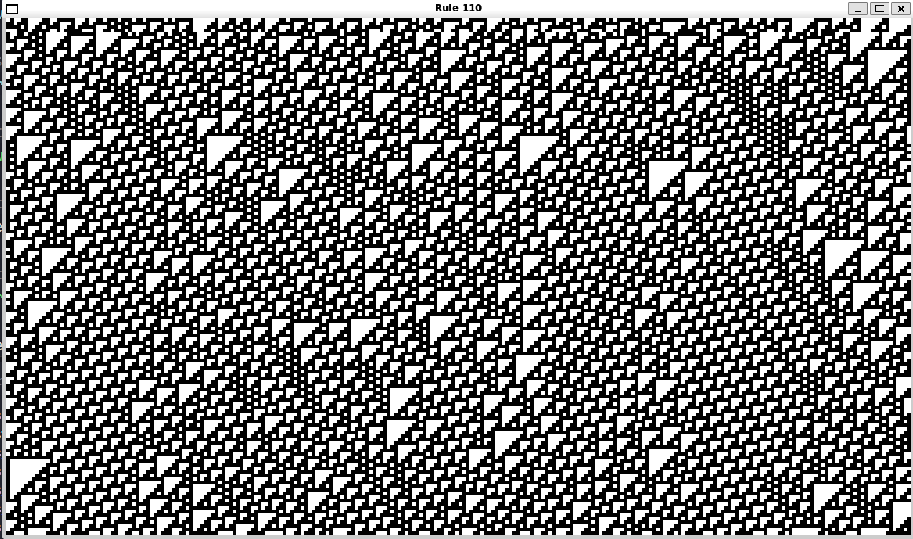

# Rule 110 Cellular Automaton

A simple implementation of **Rule 110**, a one-dimensional cellular automaton, written in **C** and visualized using **SDL2**.

---

```markdown
    
```


##  Technologies Used

- **C** — Simulation logic and program implementation
- **SDL2** — Rendering the cellular automaton
- **GCC** — C compiler
- **Make** — Build automation

---

##  Running the Project Locally

### 1. Clone the repository

```bash
git clone <your-repository-url>
cd <your-repository-directory>
```
---

### 2. Install the dependencies

This project requires:

- GCC
- Make
- SDL2 development libraries

On **Ubuntu/Debian**, you can install them with:

```bash
sudo apt update
sudo apt install gcc make libsdl2-dev
```
---

### 3. Build the project

Run:

```bash
make
./bin
```
---

### 5. Clean the build

To remove the compiled executable:

```bash
make clean
```

---

##  License

This project is open source. You can add your preferred license here, such as the **MIT License**.

---
